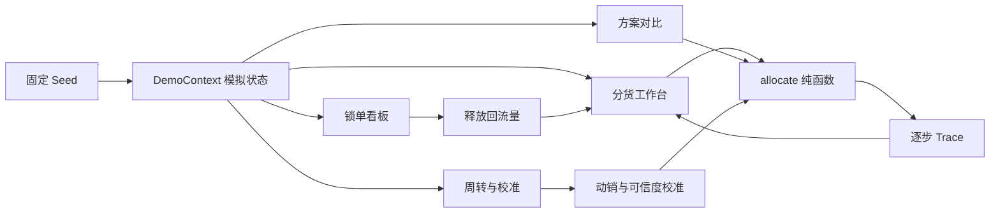

# 索尼动态分货 Demo · 完整技术路线

## 1. 产品定位

本项目是面向索尼分货运营人员的交互式演示工作台。它以固定 mock 数据模拟日常操作，但算法、状态机和跨视图数据流都是真实运行的：

- 输入变化会重新调用分货引擎；
- 方案采用会改变工作台结果；
- 锁单释放会进入回流池；
- 库存校准会修改动销参数与可信度；
- 相同 seed 和相同操作序列产生相同结果。

真实落地时，mock 数据层替换成 SAP、财务额度和库存接口，UI 与核心算法结构无需推翻。

## 2. 前端技术栈

| 层次 | 技术 | 用途 |
|---|---|---|
| 应用框架 | Next.js 16 App Router | 页面入口、静态导出、资源优化 |
| UI 运行时 | React 19 + TypeScript | 组件、交互和类型约束 |
| 样式系统 | Tailwind CSS v4 + lite 设计 token + 业务组件 CSS | 统一字体、圆角、颜色、栅格和截图模式 |
| 图表 | Recharts 3 | 方案斜率图、库存置信区间、自学习趋势 |
| 图标 | Lucide React | 统一的线性图标体系 |
| 字体 | 自托管 Inter + JetBrains Mono | 中文正文与等宽数字，不依赖在线字体 CDN |
| 状态层 | React Context + 纯函数派生状态 | 模拟时钟、跨视图联动、截图预设 |
| 测试 | Vitest | 分货、锁单、库存和方案指标单元测试 |
| 交付 | Next.js `output: export` | 生成 `out/`，可部署到任何静态站点 |

项目没有 Clerk、数据库、服务端 API、LLM 或浏览器端随机数依赖，因此静态产物可离线运行。

## 3. 代码架构

```text
app/
  layout.tsx                 根布局、字体、SEO 元数据
  page.tsx                   Demo 单页入口
  globals.css                lite 视觉 token、四视图与截图模式
src/
  core/
    allocation.ts            两层分货引擎与逐步 trace
    lockStateMachine.ts      锁单状态机
    inventory.ts             库存流量法、置信区间、周初校准
    metrics.ts               方案指标与三方案生成
    scenarios.ts             场景 × SKU 两级预置数据与查询函数
    types.ts                 领域类型
  mock/seed.ts               固定日期、库存真值和历史曲线
  store/DemoContext.tsx      唯一副作用层与跨视图状态
  components/
    DemoApp.tsx              Sidebar、TopBar、截图预设路由
    pages/                   四个操作视图
    ui/                      通用标题、状态签与图表容器
tests/                       核心纯函数测试
deploy/nginx.conf            静态站 Nginx 配置
```

## 4. 数据流



`src/core/` 不访问 React、DOM、网络或全局状态。`DemoContext` 负责模拟日期、调用纯函数和把结果写回视图。

### 4.1 场景 × SKU 数据模型

`AllocationScenario` 表示业务环境，内部包含多个 `ScenarioSkuProfile`。每个 SKU Profile 都是一次可复现求解所需的完整输入快照：

```text
AllocationScenario
  ├─ 场景名称 / 缺货业务语义
  ├─ 默认 SKU
  └─ ScenarioSkuProfile[]
       ├─ SKU id / 名称 / 品类 / 演示单价
       ├─ supply / β / seasonFactor / scarcity
       └─ Dealer[]：需求、额度、履约权重、动销、库存与置信度
```

顶部场景切换先确定可用 SKU 集合；SKU 切换再原子化替换完整 Profile，并重建分货结果、库存快照、告警和锁单任务。相同 SKU 可以出现在多个场景中，但数据互相独立，从而避免原来“一个场景只绑定一个 SKU、切换 SKU 只改显示值”的问题。

## 5. 分货算法

### 5.1 公平层

```text
公平层上限_i = min(需求_i, 额度折算数量_i)
公平水位_i(λ) = min(公平层上限_i, λ × 需求_i × 履约权重_i)
```

系统按统一满足率水位同时填充所有经销商。某经销商触达需求或额度后退出当前水位计算，未使用池量继续回流。整数份额先向下取整，尾差按小数余数从大到小分配，余数相同按 dealerId 升序。

### 5.2 效率层

```text
效率权重_i = 动销_i × 淡旺季系数 × 库存健康倍率_i
库存健康倍率 = 断货风险 1.20 / 健康 1.00 / 积压 0.65
```

效率层允许超过基础需求，但不能超过额度上限。库存不可信的经销商不参与效率层，只保留公平兜底。

### 5.3 PPT 示意场景

| 经销商 | 需求 | 额度 | 公平层 | 效率层 | 最终 |
|---|---:|---:|---:|---:|---:|
| 华东数码-A | 100 | 120 | 100 | 8 | 108 |
| 中原电子-B | 80 | 50 | 50 | 0 | 50 |
| 南方声学-C | 60 | 80 | 48 | 4 | 52 |

总供给 210，总分配 210，B 在 50 台额度处封顶。

## 6. 锁单与库存算法

锁单状态：`ALLOCATED → SOFT_LOCKED → CONFIRMED`。旁路为主动放弃和支付超时：

- 额度部分覆盖：能覆盖多少锁多少，差额立即回流；
- 主动放弃：释放锁定量，不扣履约分；
- 支付超时：释放锁定量，记录履约扣分；
- 支付确认：转为已支付，记录正向履约分。

库存流量法：

```text
估算去货量 = 期初库存 + 本期分货入库 − 期末库存
日库存估算 = 周初真值 + 累计分货入库 − 累计估算动销
```

周初真值偏差在阈值内时微调动销；超过阈值则把渠道标记为不可信。

## 7. 截图模式

`DemoApp` 读取 URL 查询参数并调用 `applyShotPreset()`。`shot=1` 会隐藏滚动条、重置按钮和 Toast；`preset` 负责准备确定性的页面状态。

| preset | 状态 |
|---|---|
| `workbench-result` | A/B/C=108/50/52，B 额度触顶 |
| `workbench-audit` | A 的逐步 trace 展开 |
| `scenarios` | 均衡方案选中，A 折线高亮 |
| `locking-timeout` | B 部分锁单后超时，回流 +50 |
| `turnover-band` | 14 天库存置信区间 |
| `calibration` | 周初校准弹窗，C 标记不可信 |

## 8. 在线部署

### 8.1 推荐：Docker + Nginx

```bash
docker build -t sony-allocation-demo .
docker run -d --name sony-demo -p 8080:80 sony-allocation-demo
```

或执行 `docker compose up --build -d`。反向代理只需把正式域名转发到容器 80 端口，并由网关或证书服务配置 HTTPS。

### 8.2 直接部署静态产物

```bash
pnpm install --frozen-lockfile
pnpm typecheck
pnpm test
pnpm build
```

将 `out/` 上传至以下任一平台：

- 企业 Nginx 静态目录；
- 对象存储 + CDN；
- Cloudflare Pages（构建命令 `pnpm build`，输出目录 `out`）；
- Vercel 静态部署；
- Kubernetes Nginx Pod。

### 8.3 CI 门禁

`.github/workflows/ci.yml` 已配置：依赖安装 → TypeScript 检查 → Vitest → 静态构建 → 上传 `out/` artifact。可在最后增加企业镜像仓库推送和生产部署步骤。

## 9. 接入真实系统的扩展路线

1. 在数据访问层增加 `/api/allocation-input`，返回供给、需求、价格、额度和库存快照。
2. 保留 `core/allocate()` 作为可测试的决策服务；需要服务端运行时可迁移到 FastAPI 或 Node 服务，前后端共享 JSON Schema。
3. 将“回写 SAP”替换为后端代理调用，前端只接收任务 ID 和状态，避免暴露凭据。
4. 用登录与租户层保护在线站点；演示环境可保持公开只读，所有写操作仍在浏览器模拟状态内完成。
5. 接入可观测性：记录输入版本、参数版本、trace、锁单结果与校准结果，以支持审计和回放。

## 10. 运行边界

- 当前数据均为固定 mock，不代表真实索尼经营数据；
- “SAP 回写”仅创建前端锁单卡，不发送外部请求；
- Demo 不使用 LLM，所有结果均由确定性规则产生；
- 正式上线需要补充身份认证、接口鉴权、审计存储和数据脱敏。
