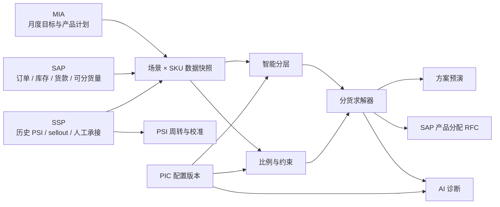

# 索尼产品动态分配 Agent Demo · 技术路线与在线部署

## 1. 产品定位

本项目用于演示《AI 赋能产品分配 Agent 动态评估开发项目 RFP 需求说明书》中的主要算法和管理能力。它采用固定、可复现的业务快照，但以下逻辑均在浏览器内真实运行：

- 六级智能分层与停靠判断；
- PA Plan Ratio 三维度合成；
- Wkly Ratio、大客户、直营 Buffer 等规则；
- 公平层、效率层、资金约束与整数守恒求解；
- 同型号多色和 Skip 特殊物料处理；
- SSP PSI sellout 周转计算与周初校准；
- 数据、结果、执行三类诊断；
- 配置版本、变更留痕、回滚和 CSV 导出。

相同 seed、相同参数和相同操作序列会得到相同结果。当前版本不访问真实 MIA、SAP 或 SSP，也不向外部系统发送数据。

## 2. 前端技术栈

| 层次 | 技术 | 用途 |
|---|---|---|
| 应用框架 | Next.js 16 App Router | 单页入口、资源构建、静态导出 |
| UI 运行时 | React 19 + TypeScript 5.8 | 组件、交互和严格类型约束 |
| 样式系统 | Tailwind CSS v4 + 业务 CSS + lite token | 字体、颜色、圆角、栅格、响应式与截图模式 |
| 图表 | Recharts 3 | 方案比较、库存置信区间和趋势图 |
| 图标 | Lucide React | 统一线性图标 |
| 字体 | 本地 Inter + JetBrains Mono | 正文与等宽数字，不依赖在线字体 CDN |
| 状态层 | React Context + 纯函数派生 | 跨页面联动、配置版本、触发状态和截图 preset |
| 测试 | Vitest | 分层、比例、特殊物料、分货、库存、诊断和配置测试 |
| 交付 | Next.js `output: "export"` | 生成完全静态的 `out/` |

项目没有数据库、服务端 API、浏览器端随机数或 LLM 依赖。静态产物可以断网运行。

## 3. 六页产品结构

| 页面 | 方案对应 | 核心职责 |
|---|---|---|
| 智能分层 | P9 | 六级组织树、P1/P2 场景、停靠阈值、判断 trace |
| 分货工作台 | P10–P13 | 三系统输入、两层求解、额度与周比例约束、逐户轨迹 |
| 方案对比 | P14 | 偏公平、均衡、偏效率三方案预演 |
| 比例与特殊物料 | P17/P20 | PA/Wkly Ratio、大客户、直营 Buffer、多色、Skip |
| 周转与校准 | P19 | SSP PSI sellout 周转、置信区间与交叉校验 |
| 后台管理 | P18/P24 | 八项配置、诊断、留痕、回滚、权限、CSV |

## 4. 代码架构

```text
app/
  layout.tsx                 根布局、字体、SEO 元数据
  page.tsx                   Demo 单页入口
  globals.css                设计 token、六页样式、响应式与截图规则
src/
  core/
    allocation.ts            公平层/效率层求解与逐步 trace
    layering.ts              六级分层、停靠和整数分摊
    ratios.ts                PA Plan、Wkly、大客户、直营 Buffer
    specialMaterials.ts      多色分配与 Skip 匹配
    inventory.ts             PSI 周转、库存估算、置信区间、校准
    diagnostics.ts           数据/结果/执行三类诊断
    configuration.ts         配置版本、审计记录与回滚
    metrics.ts               方案指标与三方案生成
    scenarios.ts             场景 × SKU 独立求解快照
    demoClock.ts             普通、演示、截图三种时间源
    types.ts                 分货领域类型
  mock/
    seed.ts                  组织树、PSI、多色、Skip 与固定业务数据
  store/
    DemoContext.tsx          唯一 UI 副作用层与跨页面状态
  components/
    DemoApp.tsx              Sidebar、TopBar、页面切换与 URL preset
    pages/                   六个操作页面
    ui/                      通用标题、状态签和图表容器
tests/                       核心纯函数测试
deploy/nginx.conf            静态站 Nginx 配置
```

`src/core/` 不访问 React、DOM、网络或全局状态；业务算法以参数作为完整输入并返回结果与 trace。`DemoContext` 只负责组织状态、调用纯函数、处理 UI 触发和准备截图 preset。

## 5. 三系统数据口径



### 5.1 MIA

- 月度产品目标；
- 产品组和渠道计划；
- Wkly Ratio 的计算基数。

### 5.2 SAP

- 可分货实物数量；
- 订单、库存和当前货款余额；
- 产品与渠道主数据；
- 正式落地时由后端代理调用产品分配 RFC。

### 5.3 SSP

- 过去 12 个月 PSI；
- 平销期与大促期周度 sellout；
- Skip 物料的人工分配承接；
- 周初真值与后续校准信息。

Demo 的三类来源标签表示数据口径，不表示已经建立真实连接。

## 6. 六级智能分层

组织层级：

```text
总部 → 渠道 → 子渠道 → 大区 → 分公司 → 经销商
```

每个节点包含目标需求、有效净需求、历史达成度和 PA Plan Ratio。算法从总部开始：

```text
节点满足度 = 分配到该节点的数量 ÷ 该节点有效净需求
```

- 满足度达到本层 PIC 阈值：停靠在当前节点；
- 未达到阈值：按子节点 PA Plan Ratio 分摊并继续下沉；
- 经销商是最小颗粒度，强制成为终点。

默认阈值：

| 层级 | 阈值 |
|---|---:|
| 总部 | 100% |
| 渠道 | 80% |
| 子渠道 | 65% |
| 大区 | 50% |
| 分公司 | 35% |
| 经销商 | 终点 |

兄弟节点的精确份额先向下取整，剩余单台按小数余数从大到小分配；余数相同按节点 ID 升序。停靠前沿的分配量之和始终等于输入供给量。

P1 使用充足货源复现总部停靠；P2 使用偏紧货源复现部分渠道停靠、其余分支继续下沉。

## 7. PA Plan Ratio 与策略比例

### 7.1 三维度合成

PA Plan Ratio 由三部分组成：

1. **供需态势**：供给覆盖率、紧张度、市场缺货度；
2. **经营状态**：订单压力、库存需求、额度覆盖、周转速度；
3. **策略配置**：Wkly Ratio、大客户 `kBig`、直营与 Buffer。

配置权重先正规化：

```text
w'j = wj ÷ Σw
PA Plan Ratio = 供需得分 × w'供需
              + 经营得分 × w'经营
              + 策略得分 × w'策略
```

每个中间量都写入 trace。权重可以不预先相加为 1，求解器会按总和正规化；至少一项必须为正数。

### 7.2 Wkly Ratio

普通客户：

```text
本周硬上限 = floor（月度目标 × Wkly Ratio）
有效上限 = min（本周硬上限, 货款余额折算数量）
```

大客户：

- 豁免 Wkly Ratio 硬上限；
- `floor（月度目标 × Wkly Ratio × kBig）` 仅作计划参考；
- 最终分配仍受货款余额、库存、供给总量和整数性约束。

因此“大客户”不是无约束加配。

### 7.3 直营优先与 Buffer

顺序固定为：

```text
总供给
  → 先满足直营需求
  → 从剩余量按 Buffer Ratio 预留
  → 形成其他渠道可分池
```

三段相加始终等于输入供给量，执行过程写入 trace。

## 8. 分货求解器

### 8.1 公平层

```text
公平层上限_i = min（需求_i, 有效硬上限_i）
公平水位_i(λ) =
  min（公平层上限_i, λ × 需求_i × 履约权重_i）
```

所有符合条件的经销商沿同一水位同步增加。某经销商触达需求、资金或周比例上限后退出当前水位，未使用份额继续分给其他经销商。

### 8.2 效率层

```text
效率权重_i =
  动销_i × 淡旺季系数 × 库存健康倍率_i

库存健康倍率：
断货风险 1.20 / 健康 1.00 / 积压 0.65
```

效率层允许超过基础需求，但不能突破有效硬上限。库存可信度为“不可信”的经销商只参加公平层。

### 8.3 公平池与缺货度

```text
缺货调整后比例 =
  公平预算 β + 缺货度 ×（1 − 公平预算 β）

最终公平比例 =
  clamp（缺货调整后比例
  + clamp（(1 − 淡旺季系数) × 0.1, −0.1, 0.1）, 0, 1）
```

### 8.4 整数和守恒

- 所有数量都先转换为非负整数；
- 比例份额先向下取整；
- 尾差按小数余数降序、ID 升序决胜；
- `Σ最终分配 ≤ 可分货量`；
- 每个经销商最终量不突破资金和适用的周比例上限；
- 若全部去向都封顶，剩余量保留为未分配供给。

### 8.5 固定示例

| 经销商 | 需求 | 资金上限 | 公平层 | 效率层 | 最终 |
|---|---:|---:|---:|---:|---:|
| 华东数码-A | 100 | 120 | 100 | 8 | 108 |
| 中原电子-B | 80 | 50 | 50 | 0 | 50 |
| 南方声学-C | 60 | 80 | 48 | 4 | 52 |

总供给 210，总分配 210。

## 9. 特殊物料

### 9.1 同型号多色

同一型号的颜色物料按过去 3 个月 DO 占比分配：

```text
可拆分总量 = min（可用量, 型号整体目标）
颜色精确份额 = 可拆分总量 × 颜色 DO ÷ Σ同型号颜色 DO
```

单色可以超过自身颜色目标，但型号合计必须小于等于型号整体目标。整数尾差同样使用最大余数与物料代码升序规则。

示例中 P1/P2 结果为 12/8，合计 20，不超过型号目标 20。

### 9.2 Skip

- 物料代码经过去空格与大小写正规化后精确匹配；
- 命中后不进入自动求解；
- 页面提示转 SSP 人工分配；
- 清单可在“比例与特殊物料”和“后台管理”中维护；
- 所有变更进入配置版本与审计记录。

## 10. SSP PSI 周转与库存校准

主口径：

```text
平销期周均 sellout = 平销周 sellout 合计 ÷ 平销周数
大促期周均 sellout = 大促周 sellout 合计 ÷ 大促周数
消化周转周期 = 当前 PSI 库存 ÷ 当前时期周均 sellout
```

若当前时期没有样本，或库存为正但 sellout 为 0，函数返回“无法估算”，而不是生成不可序列化的无穷值。

库存流量法保留为交叉校验：

```text
估算去货量 = 期初库存 + 本期分货 − 期末库存
日库存估算 = 周初真值 + 累计分货 − 累计估算去货
```

置信区间随距周初真值的天数扩大；新真值到达后重新收窄。偏差在阈值内时小步校准动销，超过阈值则降低该经销商的库存可信度。

## 11. AI 诊断

`runDiagnostics()` 接收数据字段、净需求、当前/上一轮分配、执行任务和固定 seed，输出结构化告警。

| 类别 | 真实检测规则 |
|---|---|
| 数据类 | 必填字段缺失、净需求小于 0、采集时间超过允许时效 |
| 结果类 | 满足度较上一轮下降超过阈值、HHI 集中度过高、符合条件的经销商分配为 0 |
| 执行类 | RFC 或分货任务失败、任务超时、重试达到上限 |

执行失败率使用稳定哈希与固定 seed 模拟，不调用 `Math.random()`。每条告警包含：

- 级别和类别；
- 标题与业务说明；
- 参数快照；
- 判断证据；
- 可选的 allocation/layering trace 引用。

“下钻到轨迹”通过 Context 切换到目标页面并展开相关审计信息，不依赖服务端路由。

## 12. 配置版本、留痕与回滚

后台管理覆盖：

1. Wkly Ratio；
2. 大客户标识和 `kBig`；
3. Skip 清单；
4. 多色规则；
5. 解释提示词；
6. PA Plan Ratio 权重；
7. 分配记录查询和 CSV；
8. 用户权限矩阵。

每次配置提交都会：

```text
复制当前配置
→ 应用单一变更
→ 版本号 +1
→ 保存旧值、新值、操作人、时间
→ 保留上一版本快照
```

回滚恢复上一份配置快照，并把回滚本身作为新审计事件记录。提示词只影响解释文案，不进入分货、比例或诊断计算。

## 13. 页面导航、触发与截图

项目只有一个 Next.js 页面路由 `/`。六个视图通过 `DemoView` 和 React Context 在客户端切换，因此静态托管不需要 SPA fallback 配置。

顶部触发方式：

- `arrival`：到货触发；
- `scheduled`：定时批量。

两种方式都执行数据校验、分层、比例、求解和诊断；触发类型进入执行记录和诊断上下文。

URL 模式：

| 参数 | 用途 |
|---|---|
| 无参数 | 普通在线体验 |
| `?demo=1` | 客户现场演示 |
| `?shot=1&preset=...` | 固定时间与确定性截图状态 |

截图 preset 建议包括：

- `layering-p1`
- `layering-p2`
- `workbench-result`
- `workbench-audit`
- `scenarios`
- `ratios-special`
- `turnover-psi`
- `calibration`
- `console-alerts`

## 14. 测试与工程门禁

```bash
pnpm typecheck
pnpm test
pnpm build
```

测试覆盖：

- 六级分层、P1/P2 和阈值变化；
- PA Plan Ratio、Wkly Ratio、大客户资金约束、直营 Buffer；
- 多色最大余数、型号总量、Skip；
- 108/50/52、公平/效率、额度、守恒和确定性；
- PSI 周转、置信区间与校准；
- 三类诊断和固定 seed；
- 配置提交、审计与回滚。

CI 使用 Node.js 22.16 和 pnpm 11.7，执行依赖安装 → TypeScript → Vitest → 静态构建。

## 15. Cloudflare Pages 静态部署

### 15.1 构建设置

项目已经配置：

```ts
output: "export"
images: { unoptimized: true }
trailingSlash: true
```

Cloudflare Pages 设置：

| 设置 | 值 |
|---|---|
| Framework preset | 可选 None/Next.js Static Export |
| Build command | `pnpm build` |
| Build output directory | `out` |
| Root directory | 仓库中的项目根目录 |
| Production branch | 例如 `main` |
| Node version | 22.x |

当前前端不需要运行时环境变量。构建后 Cloudflare 仅托管 HTML、CSS、JavaScript、字体和图片。

### 15.2 自动更新

Cloudflare Pages 连接 GitHub 或 GitLab 后：

1. 推送到生产分支；
2. Cloudflare 自动拉取新提交；
3. 自动安装依赖并运行 `pnpm build`；
4. 构建成功后替换正式站点；
5. 非生产分支可生成独立 Preview URL。

如只在本地修改而没有提交、推送，线上页面不会变化。

### 15.3 本地预览

```bash
pnpm build
pnpm preview
```

默认静态预览地址为 `http://localhost:4173`。

### 15.4 Docker 备选

```bash
docker build -t sony-allocation-demo .
docker run -d --name sony-demo -p 8080:80 sony-allocation-demo
```

容器仅使用 Nginx 托管静态产物。

## 16. 正式系统扩展路线

1. 建立数据访问层，按“场景 + SKU + 数据快照时间 + 参数版本”获取 MIA、SAP、SSP 输入。
2. 把 `src/core/` 纯函数迁移或复用到服务端决策服务，并共享 JSON Schema。
3. 由后端代理调用 SAP 产品分配 RFC，前端只接收任务 ID、状态和 traceId。
4. 将配置版本与审计日志持久化，增加 PIC/业务/只读角色的身份认证和鉴权。
5. 将诊断告警接入可观测平台，并保留输入快照、参数版本、结果和证据链。
6. 对线上数据做租户隔离、脱敏、重放和异常恢复。

## 17. 当前运行边界

- 所有数据均为固定 mock；
- 所有核心结果由确定性规则生成；
- RFC、下载以外的外部系统交互均为模拟；
- CSV 在浏览器内真实生成；
- 当前权限矩阵为只读演示；
- 正式上线仍需接口鉴权、持久化、监控、数据治理和安全评审。
